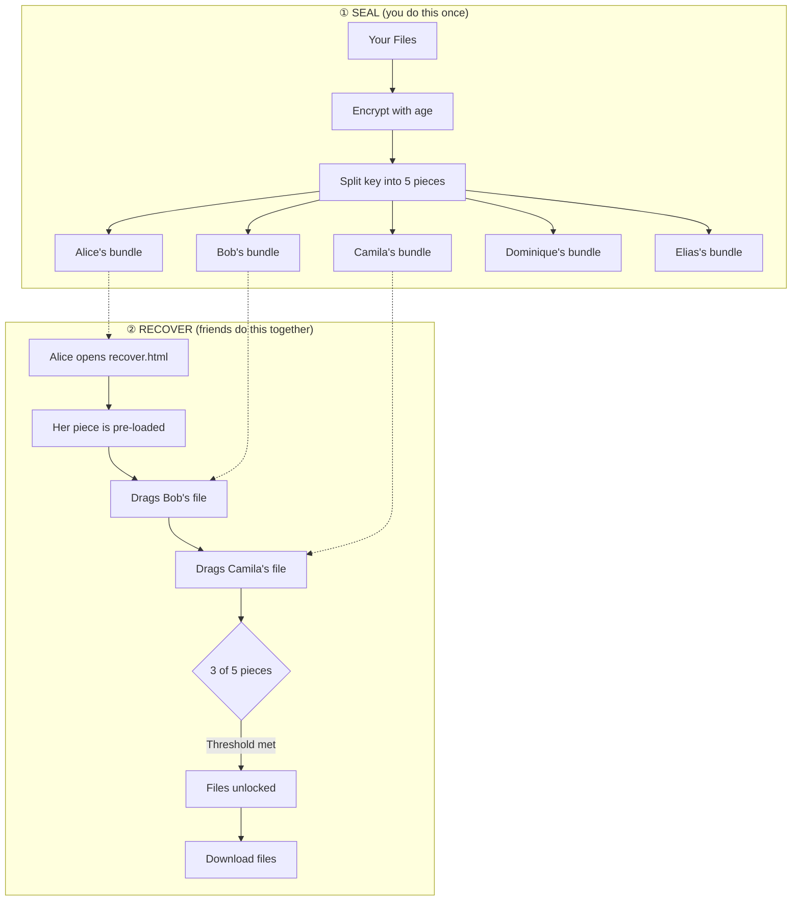
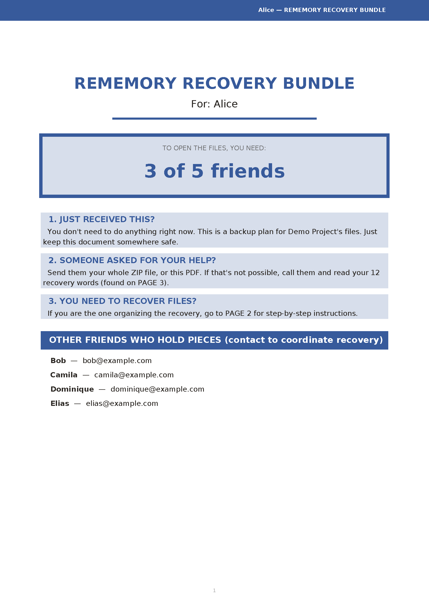
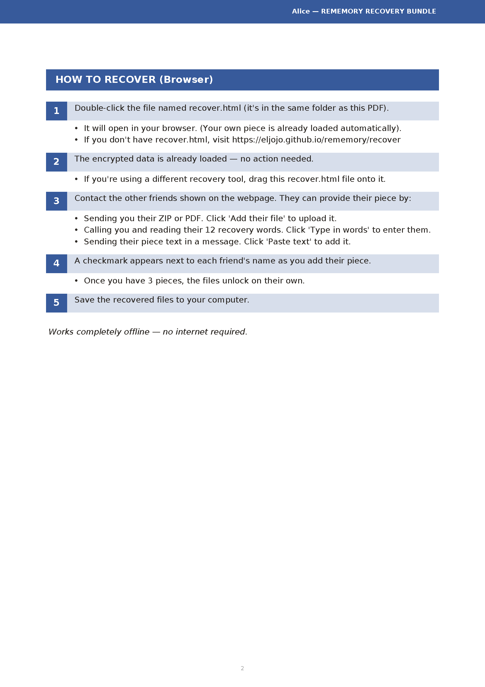
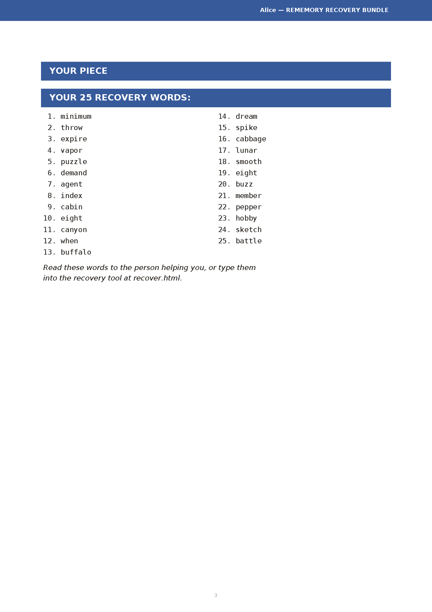
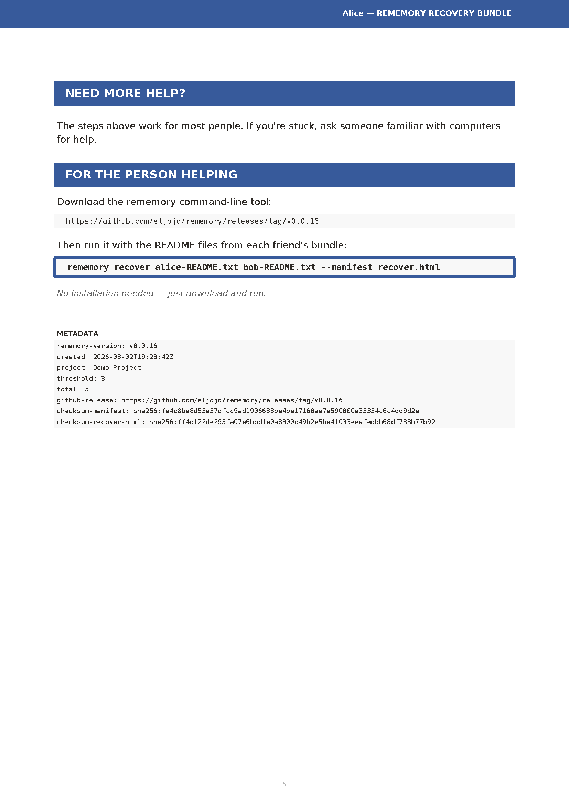

# 🧠 ReMemory

**Encrypt your files and split the key among people you trust.**

ReMemory splits a decryption key using Shamir's Secret Sharing and gives each person a self-contained tool to recover the files together — offline, in any browser.*

<sub>* [Time-locked](#time-delayed-recovery-experimental) archives need a brief internet connection at recovery time.</sub>

## Recovery works without this project

Each person receives a bundle containing `recover.html` — a browser-based recovery tool. No servers. No dependencies. No need for this project to exist when recovery happens.

**[Download demo bundles](https://github.com/eljojo/rememory/releases/latest/download/demo-bundles.zip)** to try the recovery process yourself.



Any 3 pieces can reconstruct the key, but a single piece reveals nothing — not "very little," mathematically zero information.

The number of people and the threshold are up to you: 2-of-3 for a small circle, 3-of-5 for a wider group, or 2-of-2 for a couple.

---

## Two Ways to Use ReMemory

### 🌐 Web UI (recommended)

Create bundles in your browser — no installation required.

| | |
|---|---|
| **Create Bundles** | [eljojo.github.io/rememory/maker.html](https://eljojo.github.io/rememory/maker.html) |
| **Documentation** | [eljojo.github.io/rememory/docs.html](https://eljojo.github.io/rememory/docs.html) |

Everything runs locally. Your files never leave your device.


### 💻 CLI and Docker

For automation, scripting, or if you prefer the terminal.

```bash
# macOS (Homebrew)
brew install eljojo/rememory/rememory

# Linux (x86_64)
curl -Lo rememory https://github.com/eljojo/rememory/releases/latest/download/rememory-linux-amd64
chmod +x rememory
sudo mv rememory /usr/local/bin/

# Docker (self-hosted)
docker run -d \
  --name rememory \
  -p 8080:8080 \
  -v rememory-data:/data \
  ghcr.io/eljojo/rememory:latest

# Nix
nix run github:eljojo/rememory
```

See the **[CLI User Guide](docs/guide.md)** or the **[Self-Hosted Guide](docs/selfhosted.md)** for complete documentation.

---

## Try It First

Before protecting real secrets, try the recovery process:

1. **[Download demo bundles](https://github.com/eljojo/rememory/releases/latest/download/demo-bundles.zip)** (5 friends, any 3 can recover)
2. Open `bundle-alice/recover.html` in your browser
3. Alice's piece is pre-loaded — drag two more README files onto the page. Dragging an entire bundle works too.
4. When enough pieces are combined, the files unlock

This is the closest thing to what a real recovery feels like.

---

## What Friends Receive

Each friend gets a ZIP bundle containing:

| File | Purpose |
|------|---------|
| `README.txt` | Instructions, their unique piece, contact list |
| `README.pdf` | Same content, formatted for printing |
| `MANIFEST.age` | Your encrypted files (only included separately when over 10 MB) |
| `recover.html` | Recovery tool (~300 KB), runs in any browser. For smaller archives, everything is embedded — just open this file |

**A single piece reveals nothing.** But tell your friends to keep their bundle somewhere safe — it's their responsibility to you.



<details>
<summary>More pages</summary>






</details>

---

## FAQ

<details>
<summary>Why ReMemory?</summary>

We all have digital secrets that matter: password manager recovery codes, cryptocurrency seeds, important documents, instructions for loved ones. What happens to these if you're suddenly unavailable?

Traditional approaches fail:
- **Give one person everything** → Single point of failure and trust
- **Split files manually** → Confusing, error-prone, no encryption
- **Use a password manager's emergency access** → Relies on company existing
- **Write it in a will** → Becomes public record, slow legal process

ReMemory takes a different approach:
- **No single point of failure** — requires multiple people to cooperate
- **No trust in any one person** — even your most trusted friend can't access secrets alone
- **Offline and self-contained** — recovery works without internet or servers*
- **Designed for non-technical people** — clear instructions, not cryptographic puzzles

</details>

<details>
<summary>Why I Built This</summary>

Two things drove me to create ReMemory.

First, I watched [a documentary about Clive Wearing](https://www.youtube.com/watch?v=k_P7Y0-wgos), a man who has lived with a 7-second memory since 1985. Seeing how fragile memory can be made me think about what would happen to my digital life if something similar happened to me.

Second, I've had several concussions from cycling accidents. Each time, I've been lucky to recover fully. But each time, I've been reminded that our brains are more fragile than we like to think.

ReMemory is my answer: a way to ensure the people I trust can access what matters, even if I can't help them.

</details>

<details>
<summary>Threat Model</summary>

ReMemory assumes:
- Your friends will only cooperate when needed
- At least *threshold* friends will keep their bundle safe
- Your device is trusted when you create bundles
- The browser used for recovery is not compromised

ReMemory does NOT rely on:
- Any server or cloud service
- Any ReMemory website or infrastructure
- Any long-term availability of this project
- The internet during recovery

See the **[Security Review](docs/security-review.md)** for details.

</details>

<details>
<summary>Cryptographic Guarantees</summary>

| Component | Algorithm |
|-----------|-----------|
| Encryption | [age](https://github.com/FiloSottile/age) (scrypt passphrase mode) |
| Key derivation | scrypt (N=2²⁰, r=8, p=1) |
| Secret sharing | Shamir's Secret Sharing over GF(2⁸) |
| Integrity | SHA-256 checksums |
| Passphrase | 256 bits from crypto/rand |
| Time lock (optional) | [drand](https://www.cloudflare.com/en-ca/leagueofentropy/) tlock (BLS12-381 IBE, inner layer) |

**A single piece reveals nothing about your secret.** This is a mathematical guarantee of Shamir's Secret Sharing — any fewer than *threshold* pieces contain zero information about the original secret.

</details>

<details>
<summary>Time-Delayed Recovery (Experimental)</summary>

You can set a waiting period when creating bundles. Even with enough pieces, the files stay locked until the date you chose — for example, 30 days, 6 months, or a specific date.

This uses the [League of Entropy](https://www.cloudflare.com/en-ca/leagueofentropy/) (drand), a distributed randomness beacon run by organizations around the world. At recovery time, a brief internet connection is needed — not to send data, but to verify that enough time has passed.

**CLI:** `rememory seal --timelock 30d` (or `6m`, `1y`, `2027-06-15T00:00:00Z`)
**Web:** Enable under "Advanced options" in the [bundle creator](https://eljojo.github.io/rememory/maker.html).

**Important caveats:**
- Recovery requires internet access (to check the drand beacon)
- If the League of Entropy stops operating before your time lock expires, recovery won't work
- Without the time lock, recovery works fully offline — the time lock adds this one dependency

</details>

<details>
<summary>Failure Scenarios</summary>

| What if... | Result |
|------------|--------|
| A friend loses their bundle? | Fine, as long as threshold friends remain |
| A friend leaks their piece publicly? | Harmless without threshold-1 other pieces |
| ReMemory disappears in 10 years? | `recover.html` still works — it's self-contained |
| Browsers change dramatically? | Pure JavaScript with no external dependencies |
| You forget how this works? | Each bundle's README.txt explains everything |
| Some friends can't be reached? | That's why you set threshold below total friends |
| Time lock used, but no internet at recovery? | Wait and try again — data is safe, just needs the beacon check |
| League of Entropy shuts down? | Time-locked archives become unrecoverable — only a risk if you use the time lock feature |

</details>

<details>
<summary>Development</summary>

```bash
# Using Nix (recommended)
nix develop

# Build
make build

# Run tests
make test         # Unit tests
make test-e2e     # Browser tests (requires: npm install)

# Preview website locally
make serve        # Serves at http://localhost:8000
```

</details>

<details>
<summary>Other Similar Tools</summary>

ReMemory isn't the first tool to use Shamir's Secret Sharing. Its focus is making recovery possible for non-technical people, without installing anything.

#### Shamir's Secret Sharing tools

| Tool | Type | Input | Splitting Method | Output | Non-technical Recovery | Offline | Contact Details |
|------|------|-------|-----------------|--------|----------------------|---------|-----------------|
| **[eljojo/rememory](https://github.com/eljojo/rememory)** | CLI + Web | Files & folders | Shamir's SSS | ZIP bundles with PDF instructions, `recover.html`, encrypted archive | Yes — open HTML in browser | Yes | Yes — included in each bundle |
| **[jesseduffield/horcrux](https://github.com/jesseduffield/horcrux)** | CLI | Files | Shamir's SSS | Encrypted file fragments | No — requires CLI | Yes | No |
| **[jefdaj/horcrux](https://github.com/jefdaj/horcrux)** | CLI | Files (GPG) | Shamir's SSS (via `ssss`) | `.key` + `.sig` files, steganography in images/audio | No — requires CLI + GPG | Yes (TAILS recommended) | No |
| **[paritytech/banana_split](https://github.com/paritytech/banana_split)** | Web app | Text only | Shamir's SSS + NaCl | Printable QR codes | Partial — scan QR + type passphrase | Yes (self-contained HTML) | No |
| **[cyphar/paperback](https://github.com/cyphar/paperback)** | CLI | Files | Shamir's SSS in GF(2^32) | Printable PDFs with QR codes + text fallback | Partial — scan QR or type text | Yes | No |
| **[simonfrey/s4](https://github.com/simonfrey/s4)** ([site](https://simon-frey.com/s4/)) | Web GUI + Go lib | Text/bytes | Shamir's SSS + AES | Text shares | No — copy/paste shares | Yes (save HTML locally) | No |
| **[xkortex/passcrux](https://github.com/xkortex/passcrux)** | CLI | Text/passphrases | Shamir's SSS | Text shares (hex/base32/base64) | No — requires CLI | Yes | No |
| **[ssss](http://point-at-infinity.org/ssss/)** | CLI | Text (128 char max) | Shamir's SSS | Text shares | No — requires CLI | Yes | No |
| **[cedws/amnesia](https://github.com/cedws/amnesia)** | CLI | Text/data streams | Shamir's SSS + argon2id | JSON file (Q&A-based, single user) | No — requires CLI | Yes | No |
| **[henrysdev/Haystack](https://github.com/henrysdev/Haystack)** | CLI | Files | Shamir's SSS | Encrypted file fragments | No — requires CLI | Yes | No |
| **[antonio-ivanovski/shared-secret-encrypt](https://github.com/antonio-ivanovski/shared-secret-encrypt)** ([site](https://shared-secret-encrypt.tote.mk/)) | Web app | Text only | Shamir's SSS + AES-GCM | Base58-encoded shares + encrypted message | Partial — web UI for decrypt | Yes (client-side, can save HTML) | No |
| **[MinorGlitch/ethernity](https://github.com/MinorGlitch/ethernity)** | CLI (Python) | Files | Shamir's SSS + AES-256-GCM | Printable PDFs with QR codes + text fallback, bundled browser recovery kit | Partial — scan QR or type text | Yes | No |

#### Other approaches

| Tool | Type | Input | Method | Output | Non-technical Recovery | Offline | Contact Details |
|------|------|-------|--------|--------|----------------------|---------|-----------------|
| **[msolomon/keybearer](https://github.com/msolomon/keybearer)** ([site](https://michael-solomon.net/keybearer)) | Web app | Files | Layered encryption | Encrypted file download | Partial — web UI for decryption | Yes (client-side JS) | No |
| **[RobinWeitzel/secret_sharer](https://github.com/RobinWeitzel/secret_sharer)** ([site](https://robinweitzel.de/secret_sharer/)) | Web app | Text only | Split-key AES-256 (fixed 2-of-2) | PDF with 2 QR codes + security code | Yes — scan QR codes | Yes (client-side) | No |
| **[Bitwarden Emergency Access](https://bitwarden.com/help/emergency-access/)** | Web service | Vault items + attachments | RSA key exchange (1-of-1) | Live vault access (no file output) | Yes — web UI | No (server required) | Via Bitwarden accounts |
| **[Apple Digital Legacy](https://support.apple.com/en-us/102631)** | Built-in (Apple) | Apple Account data | Legacy Contact designation | iCloud data access (3-year window) | Yes — Apple handles it | No (Apple servers required) | Via Apple Account |
| **[potatoqualitee/eol-dr](https://github.com/potatoqualitee/eol-dr)** | Guide/checklist | N/A | N/A (not a tool) | [Printable checklist](https://github.com/potatoqualitee/eol-dr/blob/main/checklist.md) covering accounts, finances, subscriptions, devices | N/A | Yes (print it) | Template fields |

**Key takeaways:**

- Most tools only handle **text or passphrases** — [eljojo/rememory](https://github.com/eljojo/rememory), both horcrux projects, [henrysdev/Haystack](https://github.com/henrysdev/Haystack), [cyphar/paperback](https://github.com/cyphar/paperback), [MinorGlitch/ethernity](https://github.com/MinorGlitch/ethernity), and [msolomon/keybearer](https://github.com/msolomon/keybearer) are the few that handle actual files.
- Only [eljojo/rememory](https://github.com/eljojo/rememory) generates a **self-contained recovery tool** (`recover.html`) bundled with each piece — no installation, no internet, no CLI needed.
- Only [eljojo/rememory](https://github.com/eljojo/rememory) includes **contact details** in each bundle so friends know how to reach each other during recovery.
- [paritytech/banana_split](https://github.com/paritytech/banana_split) and [cyphar/paperback](https://github.com/cyphar/paperback) output **QR codes** for printing, which is great for paper-based backups of short secrets.
- **Bitwarden Emergency Access** is fundamentally different — it delegates vault access to one trusted person (not M-of-N splitting) and requires an online service.
- **Apple Digital Legacy** only activates after death (requires proof of death documents) — it does not cover incapacity, memory loss, or other scenarios. Limited to Apple ecosystem (iCloud data, not Keychain passwords). Access expires after 3 years.
- [potatoqualitee/eol-dr](https://github.com/potatoqualitee/eol-dr) is not a tool but a valuable **end-of-life planning [checklist](https://github.com/potatoqualitee/eol-dr/blob/main/checklist.md)** covering accounts, finances, subscriptions, and devices — complementary to any tool here.
- [ssss](http://point-at-infinity.org/ssss/) is the classic Unix implementation but is limited to 128 ASCII characters and requires a terminal.
- GitHub offers a [successor feature](https://docs.github.com/en/repositories/managing-your-repositorys-settings-and-features/repository-access-and-collaboration/maintaining-ownership-continuity-of-your-personal-accounts-repositories) for maintaining ownership continuity of repositories — useful for ensuring your code projects remain accessible.

</details>

## License

Apache-2.0 — Copyright 2026 José Albornoz

## Credits

Built on:
- [age](https://github.com/FiloSottile/age) — Modern file encryption by Filippo Valsorda
- [age-encryption](https://github.com/FiloSottile/typage) — TypeScript age implementation, also by Filippo Valsorda
- [shamir-secret-sharing](https://github.com/privy-io/shamir-secret-sharing) — Audited Shamir's Secret Sharing by Privy (browser recovery)
- [HashiCorp Vault's Shamir implementation](https://github.com/hashicorp/vault/blob/main/shamir/shamir.go) — Shamir's Secret Sharing (CLI)
- [fflate](https://github.com/101arrowz/fflate) — Fast JavaScript compression
- [tarparser](https://github.com/highercomve/tarparser) — Tar archive extraction
- [tlock](https://github.com/drand/tlock) — Time-lock encryption via drand
- [Cobra](https://github.com/spf13/cobra) — CLI framework

Translations by:
- Slovenščina — [@h200101](https://github.com/h200101)
- Português — [@Kasama](https://github.com/Kasama)
- 中文（台灣）— [@JasonHK](https://github.com/JasonHK)

The protocol was [originally designed in a Google Doc](https://docs.google.com/document/d/1B4_wIN3fXqb67Tln0v5v2pMRFf8v5umkKikaqCRAdyM/edit?usp=sharing) in 2023.
